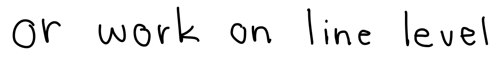

INTRODUCTION
------------
Given two images of handwritten text, this machine learning algorithm 
scans and looks for any plagiarism in the two images

### Built With
* [Tensorflow](https://www.tensorflow.org/)
* [Numpy](https://numpy.org/)
* [Cv2](https://pypi.org/project/opencv-python/)
* [SciKitLearn](https://scikit-learn.org/stable/)

DEMO
-------------
Below, the input images are displayed followed by the recognized text. 
After both images are recognized, they are scanned against each other for similarities.



```
Recognized: "or work on line level"
Probability: 0.30403316020965576
```


```
Recognized: "or work on line level"
Probability: 0.6674364805221558
```

```
file2.txt and file1.txt are 100.00% similar.
```

SETUP
------
    
1. Clone this repository using the following command

* ```git clone https://github.com/dpayba/Handwritten-Plagiarism-Scanner.git```

2. Change into source directory
* ```cd src```

3. Install the following packages:
    * argparse
    * opencv
    * collections
    * pickle
    * random
    * os
    * json
    * editdistance
    * numpy
    * tensorflow
    * sklearn
    
USAGE
------
### Running Model
1. Untar model tarball
* ```cd model```
* ```tar- xzvf model.tar.gz```
2. Switch to ```src``` directory
* ```cd ../src```
3. Execute main code
* ```python main.py --image1 ../data/image4.png --image2 ../data/line.png```
<br></br>
### Training Model
1. Download the IAM dataset from [here](https://fki.tic.heia-fr.ch/databases/iam-handwriting-database)
2. Download ```data/words.tgz```
3. Download ```data/ascii.tgz```
4. Create a directory called ```traindata```
5. Create two subdirectories: ```traindata/gt``` and ```traindata/img```
6. Put ```words.txt``` in ```gt```
7. Put ```words.tgz``` in ```img``` and untar its contents
8. Delete any files from ```model``` directory, then switch to ```src```
9. Execute the following command

   ```python controller.py --mode train --data_dir ../traindata```